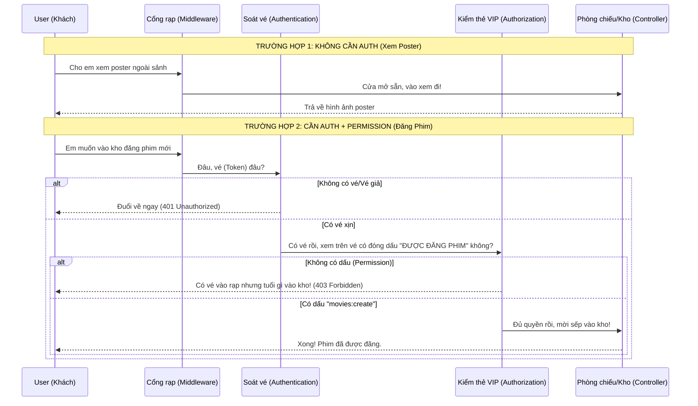

# 🏰 Giải thích Luồng Request (Cho Bò Cũng Hiểu)

Hãy tưởng tượng hệ thống của chúng ta là một **Rạp Chiếu Phim**.

## 1. Biểu đồ luồng (Sequence Diagram)

---

## 2. Giải thích siêu ngắn gọn

Hệ thống hoạt động qua 3 "vòng gửi xe":

### 🔹 Vòng 1: Tự do (No Auth)
- **Dấu hiệu:** Không thấy chữ `[Authorize]` hay `[HasPermission]` trên đầu hàm (Method).
- **Cách chạy:** Bạn cứ đi thẳng vào. Giống như đi bộ ngoài sảnh rạp phim để xem lịch chiếu, chẳng ai hỏi thẻ hay vé gì cả.

### 🔹 Vòng 2: Phải có vé (Authentication - 401)
- **Dấu hiệu:** Có chữ `[Authorize]`.
- **Cách chạy:** Ông bảo vệ sẽ chặn lại hỏi: "Bạn là ai? Cho xem vé (JWT Token)".
    - **Không có vé:** Đuổi về lỗi **401**.
    - **Có vé:** Cho qua nhưng chưa chắc được làm mọi thứ.

### 🔹 Vòng 3: Phải có quyền đặc biệt (Authorization - 403)
- **Dấu hiệu:** Có chữ `[HasPermission("tên_quyền")]`.
- **Cách chạy:** Sau khi xem vé xong, ông bảo vệ nhìn kỹ hơn xem trên vé có ghi quyền cụ thể không (ví dụ: `movies:create`, `movies:delete`).
    - **Không có quyền:** Bảo vệ bảo "Vé này chỉ để xem thôi, không được sửa!" -> Lỗi **403**.
    - **Có đúng quyền:** Mời vào làm việc!

---

## 3. Tóm tắt Code thực tế

Nhìn vào `MoviesController.cs`:

1.  **Hàm `GetMovies`:** Không có `[HasPermission]`.
    - ➡️ Bò vào xem thoải mái.
2.  **Hàm `CreateMovie`:** Có `[HasPermission("movies:create")]`.
    - ➡️ Bò phải có **Vé (Token)** + Trong vé phải ghi là được quyền **"movies:create"**.
