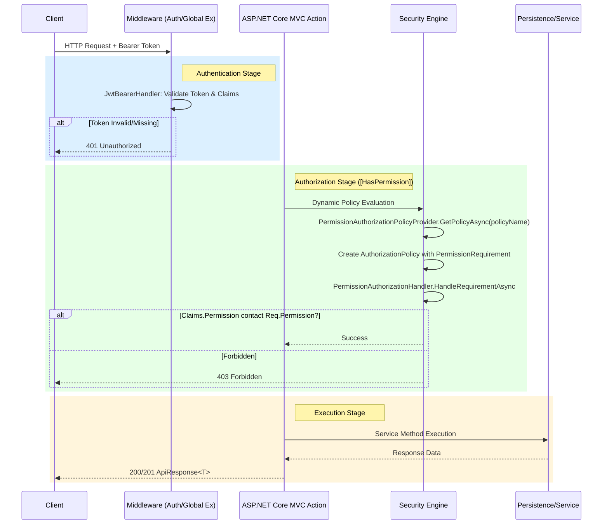

# 🛠 Request Execution Pipeline & Security Architecture

Tài liệu này mô tả chi tiết luồng xử lý một Request từ lúc vào hệ thống cho đến khi vào tới Controller, tập trung vào cơ chế **Authentication** và **Permission-Based Authorization**.

## 1. Biểu đồ luồng kỹ thuật (Technical Sequence)

---

## 2. Các thành phần chính trong Pipeline

### 🔹 1. Authentication (Kiểm danh tính)
- **Cơ chế:** Sử dụng `JwtBearerDefaults`.
- **Logic:** Token được gửi qua Header `Authorization: Bearer <token>`. Middleware sẽ giải mã, kiểm tra chữ ký (`SecretKey`), thời hạn (`Expiry`) và khởi tạo `ClaimsPrincipal`.
- **Kết quả:** Nếu thất bại, trả về **401 Unauthorized**.

### 🔹 2. Dynamic Authorization Policy
Hệ thống không sử dụng các Policy tĩnh khai báo trong `Program.cs`. Thay vào đó, nó sử dụng:
- **`HasPermissionAttribute`**: Một Wrapper quanh `AuthorizeAttribute` để truyền vào chuỗi Permission (e.g. `movies:create`).
- **`PermissionAuthorizationPolicyProvider`**: Tự động tạo ra một Policy mới lúc Runtime dựa trên Prefix `Permission:`.
- **`PermissionRequirement`**: Metadata chứa tên quyền cần kiểm tra.

### 🔹 3. Permission Handler (Xử lý quyền)
- **Class:** `PermissionAuthorizationHandler : AuthorizationHandler<PermissionRequirement>`.
- **Logic:**
    1. Lấy danh sách Claims từ `User.FindAll(PermissionClaimTypes.Permission)`.
    2. So khớp Claims với `requirement.Permission` được định nghĩa tại Attribute.
    3. Trả về `context.Succeed(requirement)` nếu hợp lệ.
- **Kết quả:** Nếu không khớp, ASP.NET tự động trả về **403 Forbidden**.

---

## 3. Workflow thực tế cho Developer

Khi bạn thêm một Endpoint mới:

1.  **Public Action (e.g. `GetMovies`):** Không thêm Attribute. Request đi xuyên qua Auth Middleware mà không bị chặn.
2.  **Protected Action (e.g. `UpdateMovie`):** Thêm `[HasPermission("movies:update")]`.
    - **Step 1:** System kiểm tra Token hợp lệ ở tầng Middleware.
    - **Step 2:** Request đi tới Filter, `PolicyProvider` sẽ tạo Policy `Permission:movies:update`.
    - **Step 3:** `PermissionAuthorizationHandler` kiểm tra xem trong danh sách Claims của User có chuỗi `"movies:update"` hay không.
    - **Step 4:** Nếu OK -> Business Logic. Nếu KHÔNG -> 403.

---

## 4. Tổng kết mã lỗi (Status Codes)
- **401 Unauthorized:** "Tôi không biết bạn là ai (Sai/Thiếu Token)".
- **403 Forbidden:** "Tôi biết bạn là ai, nhưng bạn không có quyền thực hiện hành động này".
- **200/201:** Success!
